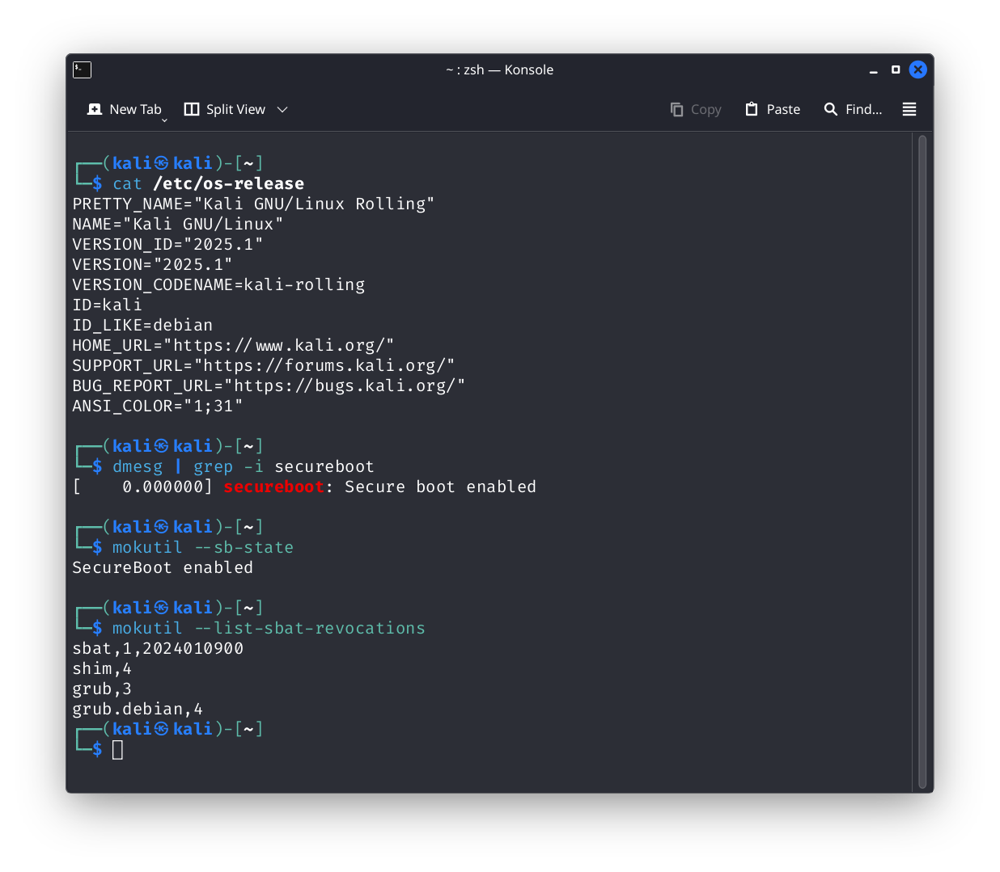

# Running Kali Linux With Secure Boot

## Description

Sometimes we have to run Kali Linux on a PC with Secure Boot enabled. Since Kali Linux kernel is not signed, you can't boot directly. A workaround is to enroll MOK(*Machine Owner Key*) via a [signed shim loader](https://github.com/rhboot/shim)(usually extracted from latest linux distributions), then you can load any *efi signed by your own key. This method was first introduced in [Super-UEFIinSecureBoot-Disk](https://github.com/ValdikSS/Super-UEFIinSecureBoot-Disk) by [ValdikSS](https://github.com/ValdikSS). An insecure PreLoader signed by MOK in stage 2 will load arbitrary efi executables: 

```txt
bootx64.efi (shim) → grubx64.efi (preloader) → grubx64_real.efi (grub2) → EFI file/OS
```

**But it may not work right now because Windows security update applies a Secure Boot Advanced Targeting (SBAT) to device in August 2024**. This shim will stop with a message like 'SBAT self-check failed'. 

[Ventoy](https://github.com/ventoy/Ventoy) also use this method, the community is highly active, you can always find the latest signed shim in [ventoy repo](https://github.com/ventoy/Ventoy/tree/master/INSTALL/EFI/BOOT).

But if we try to use this method to boot Kali Linux, it still fails, with a message like `prohibited by secure boot policy`. **The root cause is kali's grub2 is compiled with shim_lock verifier**. It reads the UEFI "SecureBoot" variable to determine whether Secure Boot is enabled, and if it is enabled, it will perform additional verification.

So simply patching the string `SecureBoot` will make GRUB think that Secure Boot is disabled. 

```c
// https://gitlab.com/kalilinux/packages/grub2/-/blob/kali/master/grub-core/kern/efi/sb.c
grub_uint8_t
grub_efi_get_secureboot (void)
{
  static grub_guid_t efi_variable_guid = GRUB_EFI_GLOBAL_VARIABLE_GUID;
  grub_efi_status_t status;
  grub_efi_uint32_t attr = 0;
  grub_size_t size = 0;
  grub_uint8_t *secboot = NULL;
  grub_uint8_t *setupmode = NULL;
  grub_uint8_t *moksbstate = NULL;
  grub_uint8_t secureboot = GRUB_EFI_SECUREBOOT_MODE_UNKNOWN;
  const char *secureboot_str = "UNKNOWN";

  status = grub_efi_get_variable ("SecureBoot", &efi_variable_guid,
				  &size, (void **) &secboot);

  if (status == GRUB_EFI_NOT_FOUND)
    {
      secureboot = GRUB_EFI_SECUREBOOT_MODE_DISABLED;
      goto out;
    }
```

## Step-by-Step Guide

Use ventoy to create a bootable USB drive. Follow this [tutorial](https://www.ventoy.net/en/doc_secure.html) to enroll MOK. Make sure you can boot into ventoy.

Download Kali Linux installer iso and a LiveCD iso, put them in ventoy usb drive.

Reboot into ventoy, select Kali Linux intaller iso, then select `Boot in grub2 mode`. Install Kali Linux as usual.

Reboot into ventoy again after installation done. **This time boot into the LiveCD**.

Mount the EFI partition of your kali installation disk. It may looks like this:

```bash
└── EFI
    └── kali
        └── grubx64.efi
```
Create a folder named `BOOT` inside `EFI`. Then download the **BOOTX64.EFI** and **grub.efi** from ventoy repo and put them in `BOOT` foler.
  
```bash
# in EFI/BOOT
wget https://github.com/ventoy/Ventoy/raw/refs/heads/master/INSTALL/EFI/BOOT/BOOTX64.EFI 
wget https://github.com/ventoy/Ventoy/raw/refs/heads/master/INSTALL/EFI/BOOT/grub.efi
```

Now switch to `kali` folder, put the [grub-shim-lock-patcher.py](https://github.com/TheCjw/kali-with-secure-boot/blob/master/grub-shim-lock-patcher.py) in `kali` folder. Then use the script to patch grub2.

```bash
python3 ./grub-shim-lock-patcher.py -i grubx64.efi -o ../BOOT/grubx64_real.efi
```

After that, your EFI partition will look like this:

```bash
└── EFI
    ├── BOOT
    │   ├── BOOTX64.EFI
    │   ├── grub.efi
    │   └── grubx64_real.efi
    └── kali
        ├── grub-shim-lock-patcher.py
        └── grubx64.efi
```

Reboot your PC, and this time you should be able to successfully enter Kali Linux. **DO NOT UPGRADE YOUR SYSTEM NOW**. You need to ensure that the patch is applied every time GRUB is updated, otherwise the system will not boot. 

You can edit your `/sbin/update-grub` file like this:

```bash
#!/bin/sh

SCRIPT="/boot/efi/EFI/kali/grub-shim-lock-patcher.py"
INPUT_FILE="/boot/efi/EFI/kali/grubx64.efi"
OUTPUT_FILE="/boot/efi/EFI/BOOT/grubx64_real.efi"

if [ -f ${SCRIPT} ]; then
 /usr/bin/python3 ${SCRIPT} -i "${INPUT_FILE}" -o "${OUTPUT_FILE}"
fi 

set -e
exec grub-mkconfig -o /boot/grub/grub.cfg "$@"
```

DONE.

